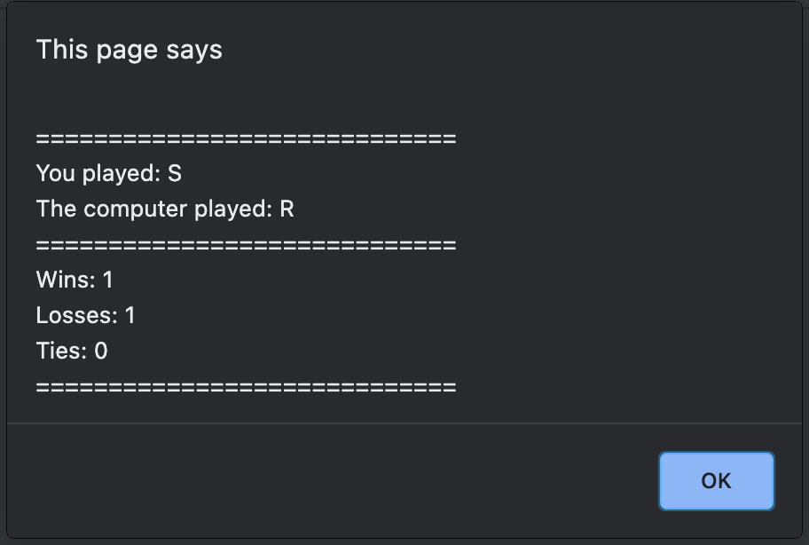
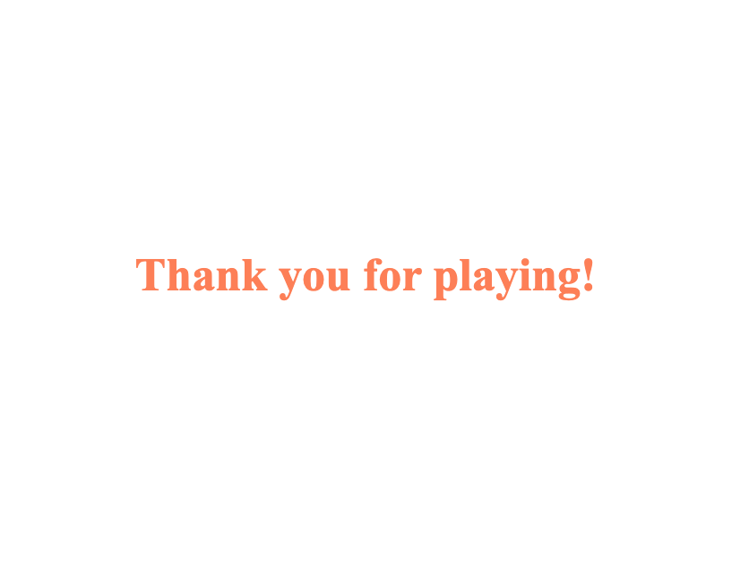

# Rock Paper Scissors - Project

## Project Description

This project is designed so you can play Rock, Paper, Scissors agianst the computer, you see the results of ties, wins and losses on the score board sheet and asked to play again at the end of each round. Beware, it's addictive!

---

## Table of Content

1. [Project Description](https://github.com/Brondchux/hw3-password-generator#project-description)
2. [Authors Info](https://github.com/Brondchux/hw3-password-generator#authors-info)
3. [Acceptance Criteria](https://github.com/Brondchux/hw3-password-generator#acceptance-criteria)
4. [Mock-Up Preview](https://github.com/Brondchux/hw3-password-generator#mock-up-preview)
5. [Useful Links](https://github.com/Brondchux/hw3-password-generator#useful-links)
6. [Credits](https://github.com/Brondchux/hw3-password-generator#credits)
7. [Licence](https://github.com/Brondchux/hw3-password-generator#licence)

---

## Authors Info

Name: Gospel Chukwu

Email: hello@gospelchukwu.com

Portfolio: [www.gospelchukwu.com](https://gospelchukwu.com/)

---

Name: Rachel Gregg

Email: TBA

Portfolio: TBA

---

## Acceptance Criteria

Our Rock, Paper, Scissors game must meet the following requirements to best satisfy our players need:

```
Given R: Rock, P: Paper, S: Scissors

WHEN I play R, and the computer played R
THEN I should see a message saying it's a tie, and the tie scoreboard should be incremented by 1
WHEN I play S, and the computer played P
THEN I should see a message saying I won, and the win scoreboard should be incremented by 1
WHEN I play P, and the computer played S
THEN I should see a message saying I lost, and the lost scoreboard should be incremented by 1
WHEN I see the scoreboard results, after that I should be asked to play again
THEN I get the chance to play agian or end the game.
WHEN I end the game
THEN I see a complematary greeting message on the center of my screen. "Thanks for playing"
```

---

## Mock-Up Preview

The image below shows the preview of my scoreboard and greeting-message after playing this Rock, Paper, Scissors game.





---

## Useful Links

1. 🗂 [Click me to view github repository for this project](https://github.com/Brondchux/hw3-password-generator)
2. 🌍 [Click me to view deployed application on github pages](https://brondchux.github.io/hw3-password-generator)

---

## Credits

Appreciations to Ben 🙌🏾 of [Columbia University Coding Bootcamp](https://bootcamp.cvn.columbia.edu/coding/landing-ftpt/?s=Google-Brand&msg_cv_scta=4&msg_cv_stbn=1&msg_cv_fcta=1&dki=Learn%20Coding&pkw=%2Bcolumbia%20%2Bcoding%20%2Bbootcamp&pcrid=471112563836&pmt=b&utm_source=google&utm_medium=cpc&utm_campaign=GGL%7CCOLUMBIA-UNIVERSITY%7CSEM%7CCODING%7C-%7COFL%7CTIER-1%7CALL%7CBRD%7CBMM%7CCore%7CBootcamp&utm_term=%2Bcolumbia%20%2Bcoding%20%2Bbootcamp&s=google&k=%2Bcolumbia%20%2Bcoding%20%2Bbootcamp&utm_adgroupid=111600049635&utm_locationphysicalms=9067609&utm_matchtype=b&utm_network=g&utm_device=c&utm_content=471112563836&utm_placement=&gclid=CjwKCAjwlrqHBhByEiwAnLmYUA8CIItksRJF6IT6XMX8WOOJBO-jtCRkzXZhI2gvsZrFEpYdRXy54RoC6jQQAvD_BwE&gclsrc=aw.ds) for being our tutor in this bootcamp.

Special thanks to [Google](https://www.google.com) for helping me find the accurate answers to my questions in a very timely manner.

Shout out to my co-author, Rachel Gregg for helping out with putting this code together.

---

## Licence

Coming soon!
